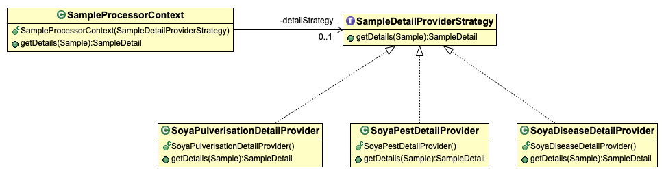
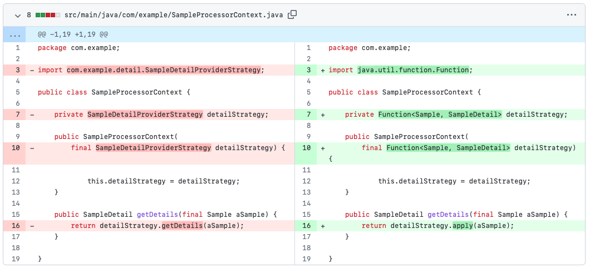
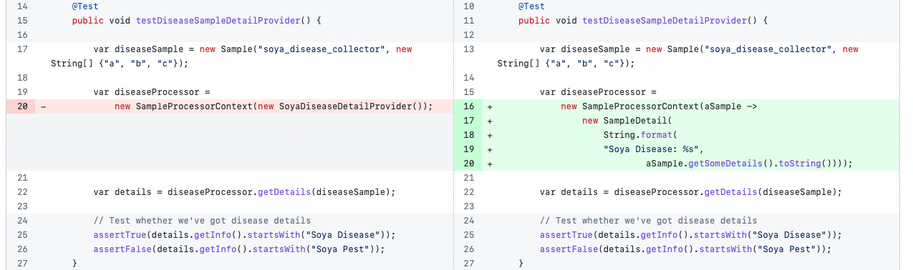

# Strategy Design Pattern Example - Using java.util.Function 
This branch replaces the _strategy_ hierarchy with java.util.Function. Please refer to the [main branch](https://github.com/gabrielcostasilva/dp-strategy.git) to better understand the project.

## Changes
The original structure consisted of a _context_ class and four classifiers. `SampleDetailProviderStrategy` defines the contract for concrete _strategy_ implementations. `SoyaPulverisationDetailProvider`, `SoyaPestDetailProvider` and `SoyaDiseaseDetailProvider` implement the contract, representing concrete _strategies_.



Since Java 8 came out, many approaches to improve design patterns with new Java features have been proposed. Using `java.util.Function` for improving the _Strategy Design Pattern_ is one of them.

In fact, one can observe that `SampleDetailProviderStrategy` is a _functional interface_. It is also very similar to `java.util.Function` as it receives a parameter and returns an object. 

Therefore, one can significantly reduce the number of classes by using `java.util.Function` instead of creating an entire new hierarchy of classes.

The figure below highlights the changes in the _context_ class.



**However, note that** the behaviour implemented in the _strategy_ classes now moved to the _client_, responsible for calling the _context_ class. The figure below shows this change, which is clearly seen in the test class.



> Notice that the prior test just instantiated the _strategy_ (line 20), but the new test is now responsible for implementing the behaviour (lines 16-20).

Moving the _strategy_ to the client makes the project more extensible as the client can implement new _strategies_ whenever it is necessary. On the other hand, one may expect to have ready-to-use _strategies_.

## Project Setup
```
mvn clean test
```
