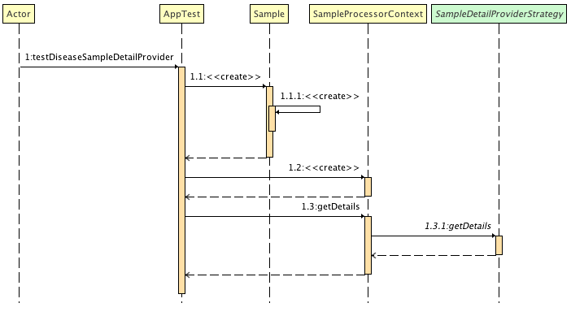

# Strategy Design Pattern Example
Although this project is not based on any particular tutorial, I mainly used the [Refactoring Guru](https://refactoring.guru/design-patterns/strategy/) explanation as reference when implementing the code.

## Project Overview
The use case considers a `SampleDetail` data extraction process. A `Sample` might carry data for _pest_, _disease_ or _pulverisation_. The `SampleDetail` varies with the `Sample` type. However, the `Sample` type is only revealed at runtime. This is when the Strategy DP come at handy.

`SoyaPulverisationDetailProvider`, `SoyaPestDetailProvider` and `SoyaDiseaseDetailProvider` are _concrete strategies_ for extracting detail data from a `Sample`. All three providers are based on a common interface: `SampleDetailProviderStrategy`. Therefore, they share the `getDetails(Sample): SampleDetail` method. 

The access to _concrete strategies_ is made from the `SampleProcessorContext`, representing the _context_. It provides a `getDetails(Sample): SampleDetail` method that acts as a wrapper to the one of the _concrete strategies_. The _context_ sets the _concrete strategy_ during its instantiation, via `SampleProcessorContext.SampleProcessorContext(SampleDetailProviderStrategy)` constructor. The resulting `SampleDetail` carries the details of the processed `Sample`.

## Class Structure


* `Sample` is an entity that carries information about _pest_, _disease_, or _pulverisation_. Each of these items have different data. The entity is classed according to the data it carries. But this data is only known at runtime;

* `SampleDetail` is an entity that stores `Sample` details. This entity must be specific for _pest_, _disease_, or _pulverisation_. Therefore, different data must be extracted from `Sample` to assembling a `SampleDetail`;

* `SampleProcessorContext` is the wrapper class that gives access to different `SampleDetailProviderStrategy` implementations. It has a private attribute (`detailStrategy`), set via the constructor during the class instatiation. This attribute defines the _concrete strategy_ to adopt; 

* `SampleDetailProviderStrategy` is a Java `interface` that sets a common method for _concrete strategies_. This common method represents the expected behaviour of any `SampleDetailProviderStrategy`;

* `SoyaPulverisationDetailProvider`, `SoyaPestDetailProvider`, and `SoyaDiseaseDetailProvider` represent _concrete strategies_ that identifies the `Sample` type and creates a `SampleDetail` according to the data.

## Flow Structure



The Figure shows the test execution for a _disease_ `Sample` type. A `Sample` is instantiated, simulating a _disease_ sample type. A `SampleProcessorContext` is instantiated with a _concrete_ `SampleDetailProviderStrategy` - in this case, the `SoyaDiseaseDetailProvider` _strategy_. 

When `SampleProcessorContext.getDetails(Sample)` is invoked, the request is passed to `SoyaDiseaseDetailProvider.getDetails(Sample): SampleDetail`. 

## Project Setup
```
mvn clean test
```
